# ApnaCafe ☕ - Smart Coffee Shop App

Welcome to **ApnaCafe**, a state-of-the-art, AI-driven coffee shop mobile application. This project features a cross-platform mobile frontend and a high-performance Python FastAPI backend. The app integrates a voice-enabled multi-agent customer service assistant, product recommendations based on collaborative association rule mining, custom user authentication, and a complete admin management interface.

## 📱 Application Screenshots

Below is a detailed walkthrough of the ApnaCafe mobile application screens:

### Onboarding & Authentication
| Onboarding | Login | Signup |
|:---:|:---:|:---:|
| 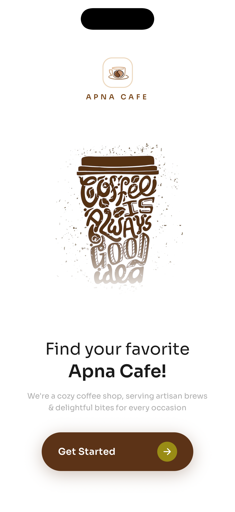 | 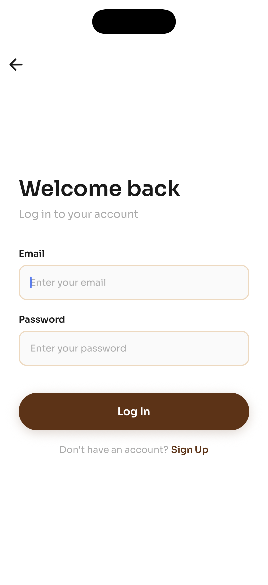 | 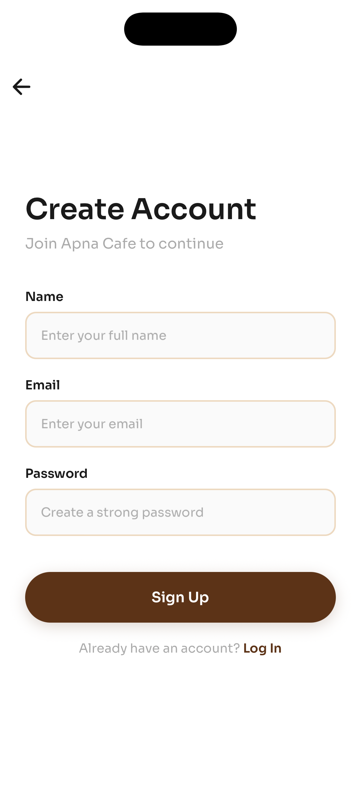 |

### Home & Menu Exploration
| Home Feed | Search & Filter | Menu Details | Item Sizing |
|:---:|:---:|:---:|:---:|
| 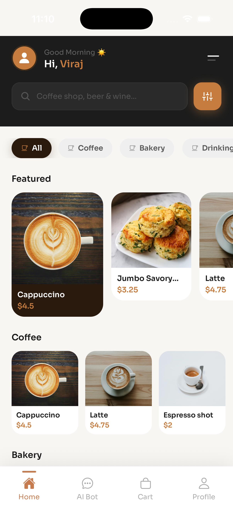 | 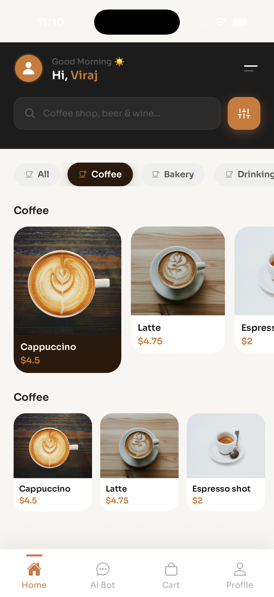 | 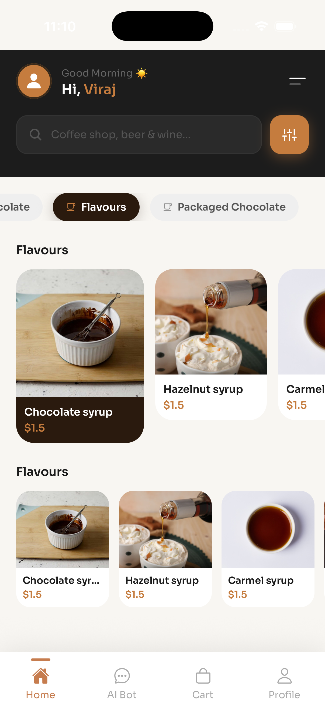 | 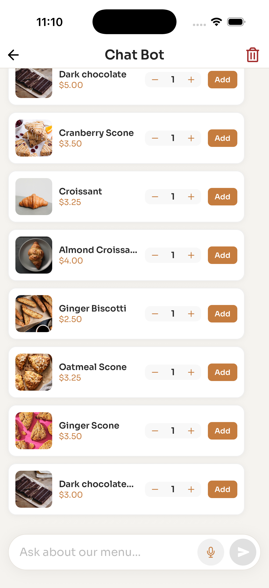 |

### AI Chatbot Assistant (Voice & Text)
| Chat Greeting | Voice Recording | Cart Management |
|:---:|:---:|:---:|
| 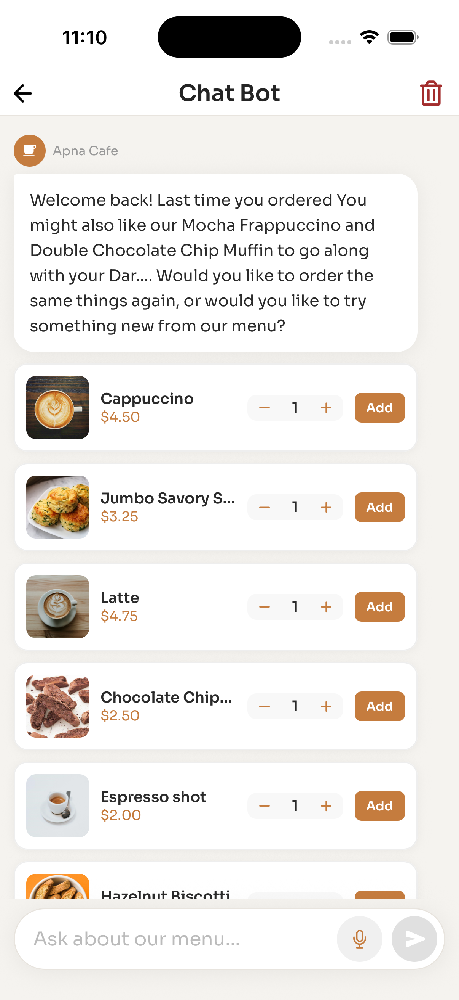 | 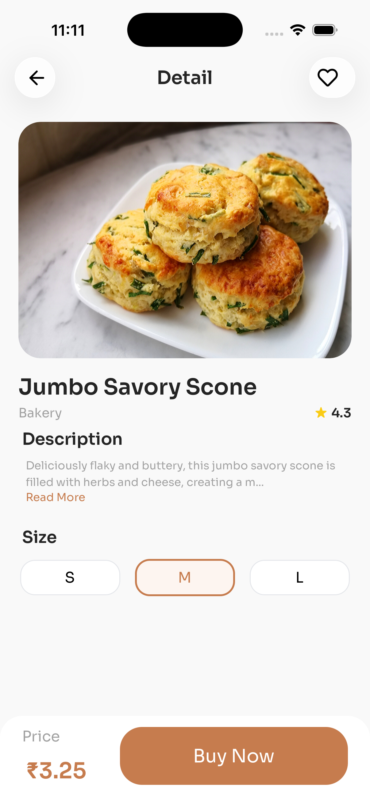 | 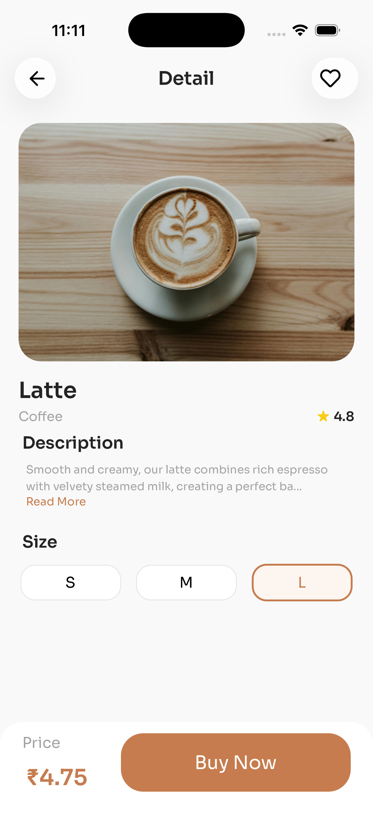 |

### Cart, Checkout & User Profile
| Cart List | Checkout Details | Order Thank You | Profile |
|:---:|:---:|:---:|:---:|
|  | 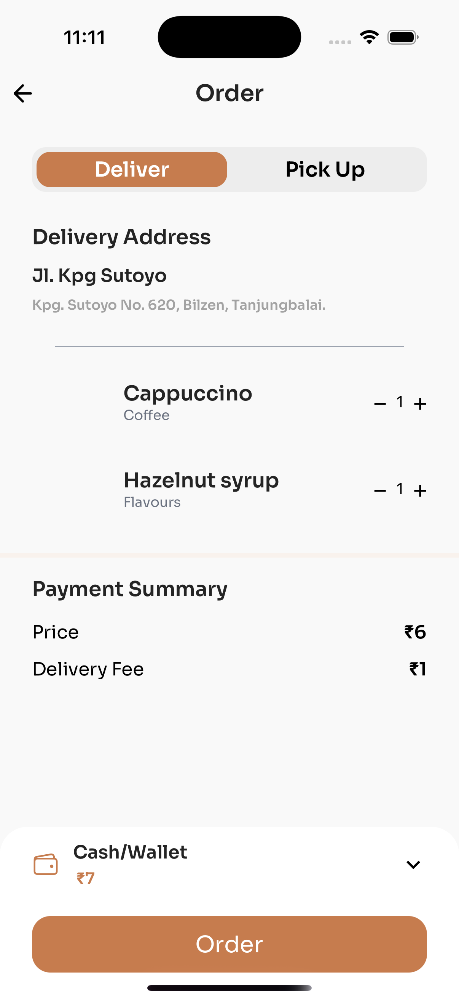 | 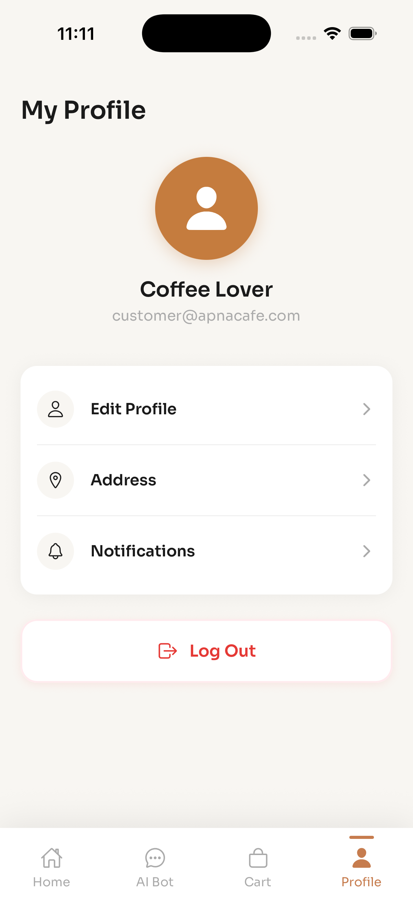 | 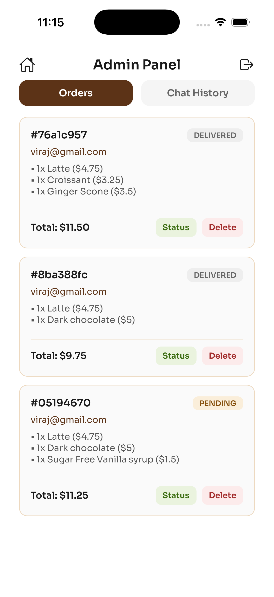 |

### Admin Dashboard (Order Management & Chat Supervision)
| Admin Order Tracking | Admin Conversational Logs |
|:---:|:---:|
|  | 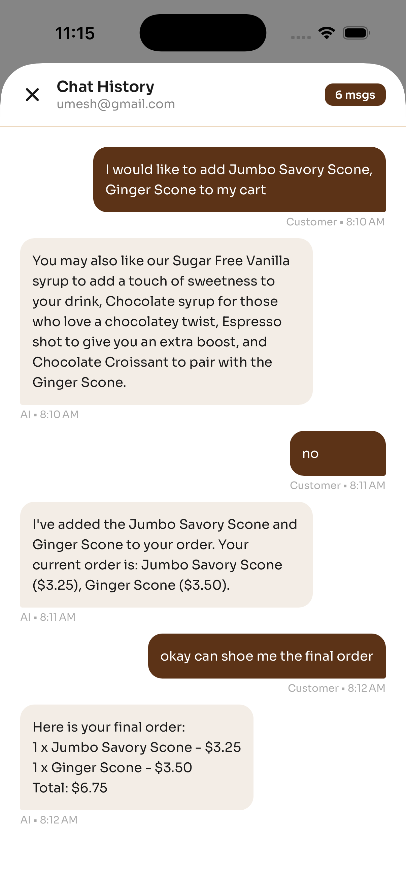 |

---

## 🛠️ Tech Stack & Architecture

- **Frontend Mobile App**: Built with [Expo](https://expo.dev) & React Native (TypeScript) utilizing Expo Router for file-based routing.
  - **State Management**: React Context API for cart state control.
  - **Styling & Layout**: Custom styling featuring the **Sora** typography family, `react-native-responsive-screen` for adaptive sizing, and `expo-linear-gradient` for premium aesthetics.
  - **Animations**: Implements spring physics and entry effects via React Native's `Animated` library and `react-native-reanimated`.
  - **Audio & Voice Processing**: Integrates native voice recording and text-to-speech with `expo-av`, `expo-audio`, and `expo-speech`.
  - **Networking & Cache**: Native REST operations with `axios`, stateful authorization headers, and local session caching via `@react-native-async-storage/async-storage`.
- **Backend API**: Powered by [FastAPI](https://fastapi.tiangolo.com) (Python), serving REST endpoints and managing real-time speech-to-text processing.
- **AI Agent System**: Employs local [Ollama](https://ollama.com) models (Llama 3.1 & nomic-embed-text) coupled with a [Pinecone](https://www.pinecone.io) vector database to deliver context-aware, stateful conversations.

---

## 📱 Features

1. **Animated Onboarding Landing Page**:
   - Interactive launch page ([`app/index.tsx`](./app/index.tsx)) with smooth entry animations (logo spring scaling, text fade-in, and CTA button slide effects) built with native driver animations.
   - Built-in session loader that checks credentials on launch and routes the user automatically (Admins to the portal, customers to the home feed).

2. **User Authentication & Session Persistence**:
   - Secure and stateful authentication workflow with dedicated **Login** ([`app/login.tsx`](./app/login.tsx)) and **Signup** ([`app/signup.tsx`](./app/signup.tsx)) screens.
   - Uses **AsyncStorage** ([`services/tokenStore.ts`](./services/tokenStore.ts)) to store access tokens, usernames, and roles (`customer` vs `admin`) for persistent user sessions.

3. **Category Catalog & Search**:
   - Clean, modern UI with coffee categorization, real-time product search, and featured products lists ([`app/(tabs)/home.tsx`](./app/(tabs)/home.tsx)).
   - Built-in horizontal scroll bars and high-performance list structures.

4. **Custom Sizing & Shopping Cart Context**:
   - Product details page ([`app/details.tsx`](./app/details.tsx)) with customizable size options (S, M, L), dynamic price recalculation, and animated additions to the cart.
   - State managed centrally by **Cart Context** ([`components/CartContext.tsx`](./components/CartContext.tsx)) to track items, counts, and totals.
   - Interactive checkout screen ([`app/(tabs)/order.tsx`](./app/(tabs)/order.tsx)) for reviewing, adjusting quantities, and placing orders, triggering a dedicated **Thank You** screen ([`app/thankyou.tsx`](./app/thankyou.tsx)).

5. **AI Voice & Text Assistant**:
   - Stateful Chat Room ([`app/(tabs)/chatRoom.tsx`](./app/(tabs)/chatRoom.tsx)) for talking or recording voice messages.
   - Integrates speech-to-text where recorded audio notes (`.m4a`) are sent to the FastAPI backend, converted to 16kHz mono WAV, transcribed, and processed.
   - Support for text-to-speech using `expo-speech` to let the chatbot speak its responses out loud.
   - Renders interactive order summary/recommendation cards directly inside the chat bubbles, allowing the customer to add suggested items to their cart with one click.

6. **Multi-Agent Routing**:
   - Uses an [`agent_controller.py`](../python_code/api/agent_controller.py) to manage agent pipelines:
     - **Classification & Guardrail Agent**: Analyzes prompts for safety and routes them to appropriate agents.
     - **Details Agent (RAG)**: Connects to a Pinecone knowledge index to answer general questions (hours, location, policy).
     - **Recommendation Agent**: Suggests items based on historical pairings (Apriori algorithms) and overall popularity.
     - **Order Taking Agent**: Takes, updates, and completes customer orders.

7. **Admin Control Panel**:
   - Administrative portal ([`app/admin.tsx`](./app/admin.tsx)) to track customer orders (updating status or deleting entries) and inspect user-chatbot logs.

---

## 🚀 Getting Started

### 📋 Prerequisites
1. Install [Node.js (v18+)](https://nodejs.org/)
2. Install [Python (3.9+)](https://www.python.org/)
3. Install [FFmpeg](https://ffmpeg.org/) (needed on your host machine for speech conversions)
4. Set up [Ollama](https://ollama.com) locally and fetch the required models:
   ```bash
   ollama pull llama3.1:8b
   ollama pull nomic-embed-text
   ```

---

### 1. Backend Setup (FastAPI & Ollama)
The backend is located in the `python_code` directory.

1. Navigate to the directory:
   ```bash
   cd ../python_code
   ```
2. Create and activate a Python virtual environment:
   ```bash
   python3 -m venv venv
   source venv/bin/activate
   ```
3. Install dependencies:
   ```bash
   pip install -r requirements.txt
   ```
4. Configure environment variables in a `.env` file inside `python_code/`:
   ```env
   PINECONE_API_KEY="your-pinecone-api-key"
   PINECONE_INDEX_NAME="coffeeshop"
   MODEL_NAME="llama3.1:8b"
   ```
5. Launch the FastAPI server:
   ```bash
   cd api
   uvicorn main:app --host 0.0.0.0 --port 8000 --reload
   ```
   The backend API will run on `http://localhost:8000`.

---

### 2. Frontend Setup (Expo Mobile App)
The frontend code is inside the `ApnaCafe` directory.

1. Install project dependencies:
   ```bash
   npm install
   ```
2. Create or configure your `.env` file in the root `ApnaCafe` directory to reference your local machine's IP address (to allow mobile testing):
   ```env
   EXPO_PUBLIC_API_URL=http://<YOUR_LOCAL_IP>:8000
   ```
3. Start the development server:
   ```bash
   npx expo start
   ```
4. Open the app:
   - Scan the QR code using the **Expo Go** app on your physical iOS/Android device.
   - Press `a` for Android Emulator or `i` for iOS Simulator.
   - Press `w` to run a preview on your web browser.
# AI-Restaurant-App
